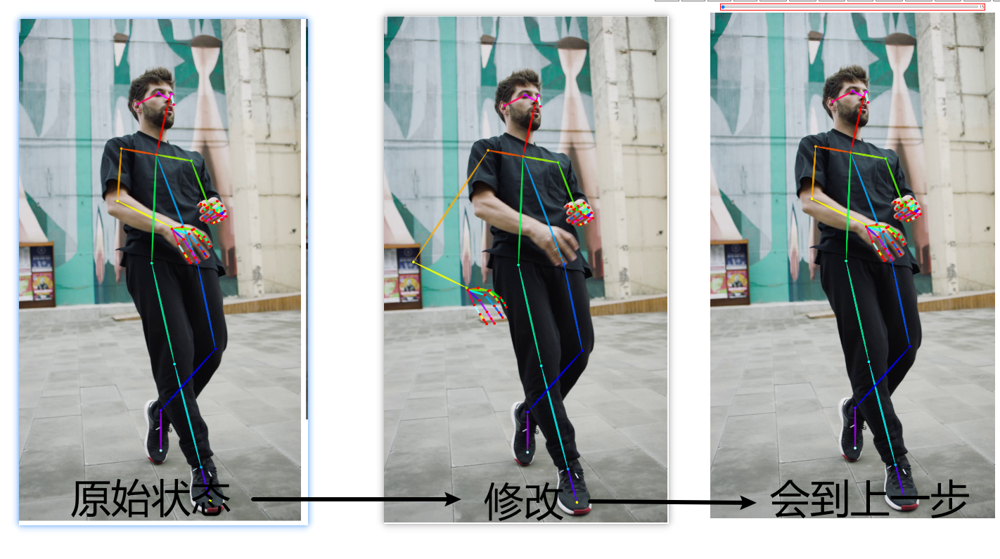
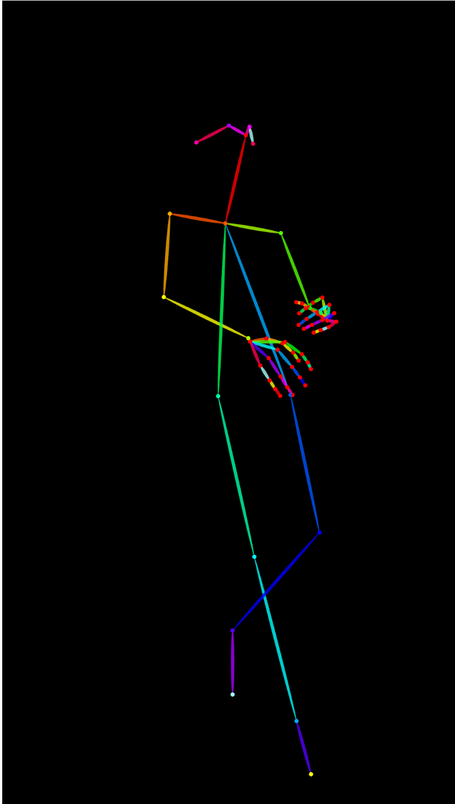
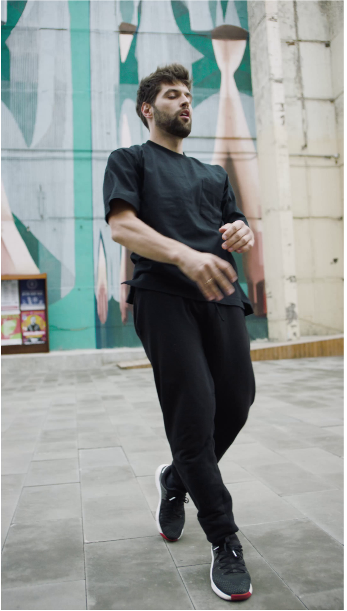
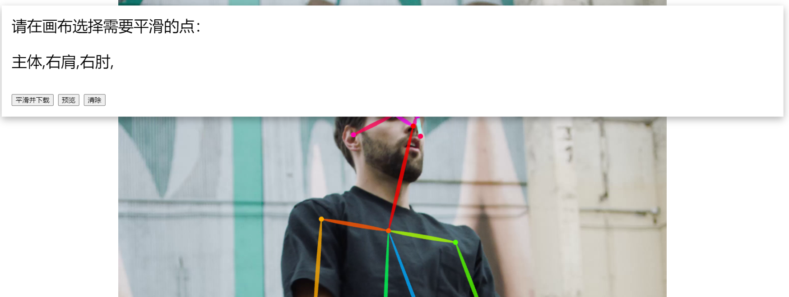
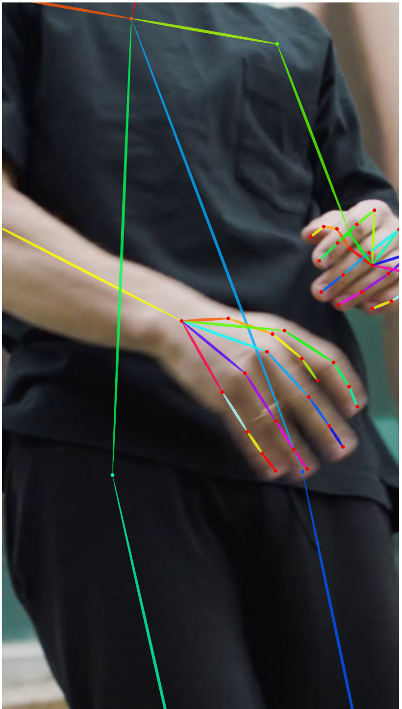
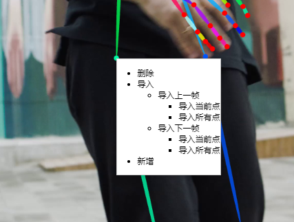
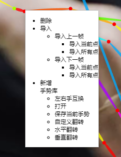
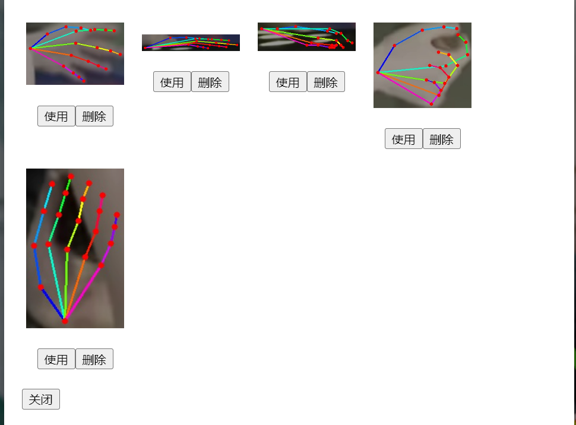

# PoseX - bone detection and binding
> By uploading videos and pictures, human bones are detected and bound, bones with low accuracy are corrected, and bones that cannot be identified are predicted
> based on dwpose (body) (https://github.com/IDEA-Research/DWPose) and mediapipe (hand) (https://github.com/google-ai-edge/mediapipe)
>
>
> 
[English](README.md) · [简体中文](README_ZH.md)

## Operation steps
1. File upload

Support uploading a single picture, a single video, after the identification is completed, the identification result is displayed according to the frame, the identification result is stored in the folder, the folder is named the md5 value of the file, the identification result is stored in the data folder, the second upload does not need to be identified again:

2. Reset (A)

The current frame is recorded after each change, and a reset restores the history to its original state

3. Go back to step (Z)

The current frame is recorded after each change, and a reset restores the previous history of the history

4. Re-identification (S)
The current operation frame and single frame picture are identified separately, and the persistent recognition result is updated

5. Show/Hide background (D)

Only the bones are shown, not the background

6. Show/hide pose(F)

Only the background is shown, not the bones

7. Save (G)

Store the skeleton operations in the current frame persistently

8. Save Pictures (H)

Save the current state of the frame as a picture for download

9. Download (J)

Download the latest bone data for all frames of the current picture or video in pkl format

10. DELETE Records

Delete the persistent data of the current picture or video, where the upload needs to be re-identified

11. Import previous frame (K)

For video use, import bone data from the previous frame of the current frame

12. Import next frame (L)

For video use, import bone data from the current frame to the next frame

13. Preview

For video use, preview all the bone data of the current video for dynamic display

Click preview here to stop

14. Smooth

For the use of video, handle the incoherence of specific bone points. Click the bone points that need to be smoothed in the screen, click preview to see the smoothed effect (the effect is the same as 13, preview), and download the smoothed data (the same as 9, download).

Click Smooth again to exit smooth

## Shortcut key
1, the above part of the operation steps, some items behind the shortcut key, according to the shortcut key operation can also achieve the above functions

2, the upper and lower frame switch: directly click the preview picture of the upper and lower frames, or press the left and right arrow keys, you can switch the upper and lower frames, and automatically save the skeleton data of the current frame before switching

3, canvas scaling: press the up and down shortcut keys, you can realize the scaling of the canvas, the scaling center is the center of the current picture (if the specified point is enlarged, the scaling center is the specified point)

4, specific point amplification: hold down the Ctrl key, click any point in the canvas, you can achieve the point amplification, enlarged point for the canvas center

5, bone point linkage: hold down the Alt key, while moving specific bone points, all downstream bone points move at the same time

6, bone point rotation: Hold down the Shift key, while moving the specific bone point, all the downstream bone points rotate at the same time, the rotation center is the upper bone point of the click point

## Bone point editing
1. Move bone points

Click on the specific bone point, hold down and drag, move to complete the release of the mouse, and record the history for sequential operations

2. Remove bone points

Move the mouse to the specific bone point, click the right mouse button, select Delete button

2. Add bone points

For the bone points that have been deleted or identified, right-click the end bone points and select the new option to predict and add bone points according to the next frame data

3. Introduce bone points

Import current point: Import the current bone point data of the previous frame or the next frame of the current frame

Import All points: Import all current and downstream bone point data from the previous or next frame of the current frame

4. Gesture operation

In view of the complicated situation of the hand and the inaccurate recognition, click the left and right palm points, and you can perform gesture operation separately. Through gesture operation, you can quickly realize the operation of bone points, such as:
4.1. Switch between left and right hands

Swapping left and right hand bone data,

4.2. Save the current tidy

Save the current hand bone data and hand background image to the gesture library

4.3. Open and use gestures

The gesture that matches the current gesture in the current gesture library can be used by clicking to replace the bone data of the current hand

4.4, horizontal and vertical flip: hand bone point as the center, horizontal or vertical flip gesture