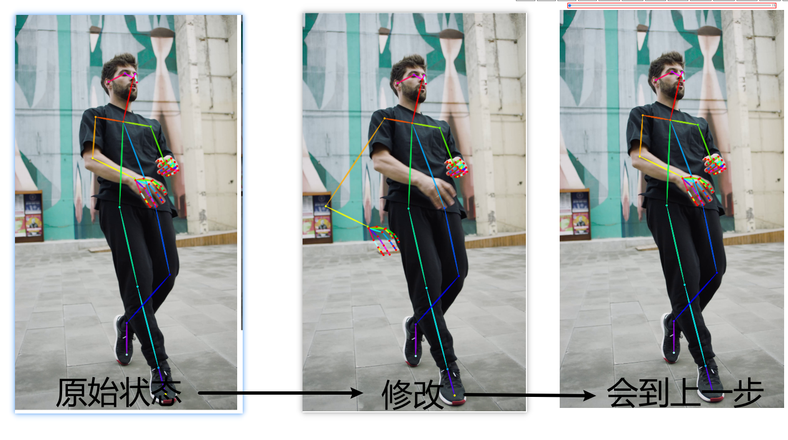
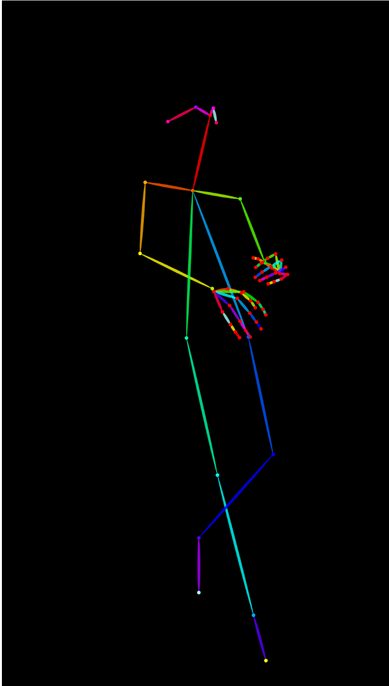
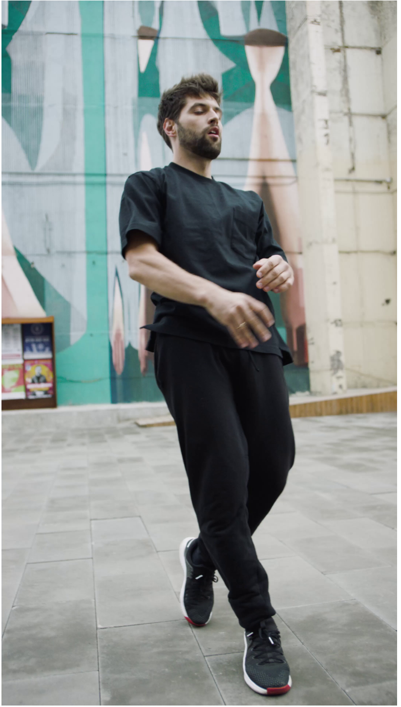
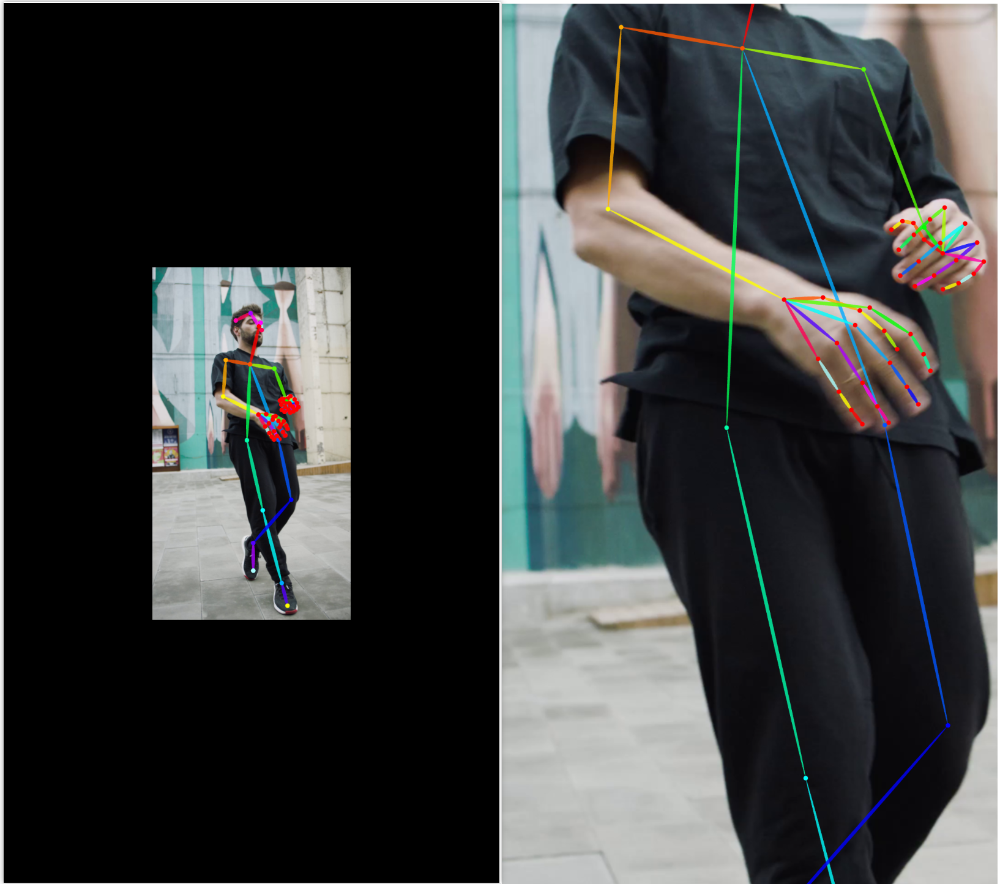
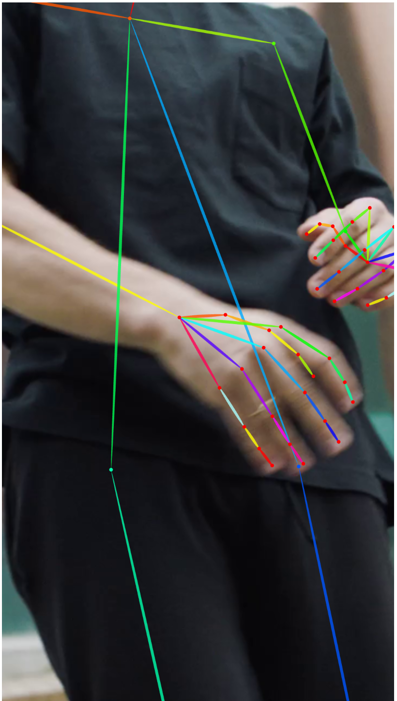
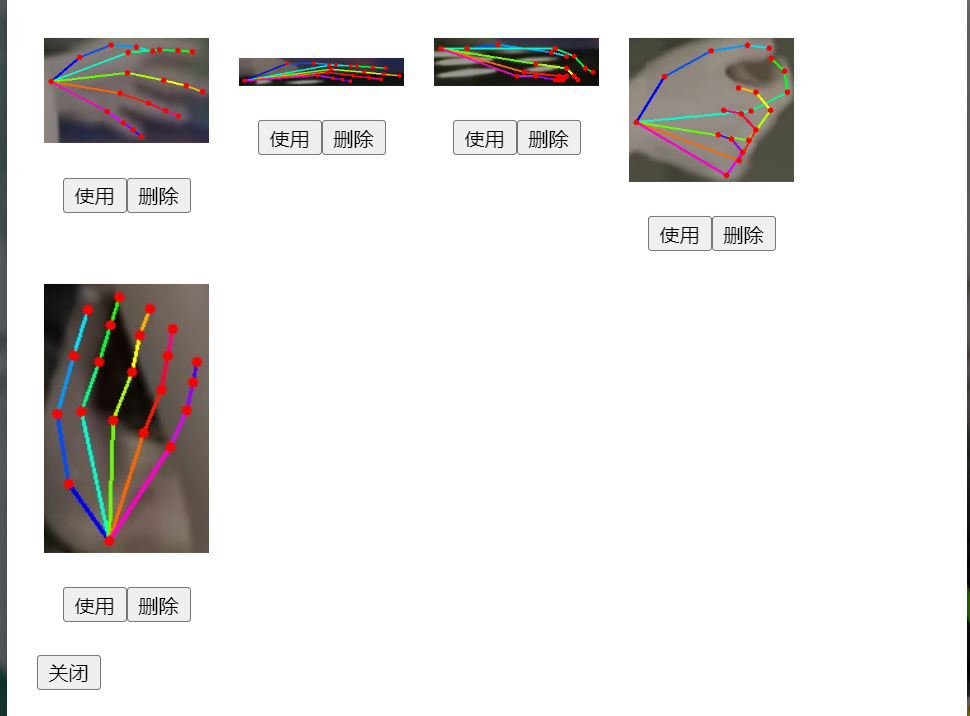

# PoseX  -  骨骼检测与绑定
> 通过上传视频和图片，对人体骨骼进行检测和绑定，对准确度不高的骨骼进行修正，对无法识别的骨骼进行预测
> 基于dwpose（肢体）（https://github.com/IDEA-Research/DWPose） 和mediapipe（手部）（https://github.com/google-ai-edge/mediapipe）
>

[English](README.md) · [简体中文](README.ZH.md)
## 操作步骤
1、文件上传

支持上传单张图片、单个视频，识别完成后，按帧显示识别结果，识别结果存储到文件夹中，文件夹名为文件的md5值，识别结果存储在data文件夹中，第二次上传不需要再次识别：

2、重置(A)

当前帧每次变化之后都会进行历史记录，重置即恢复到历史记录的最初状态

3、回到上一步(Z)

当前帧每次变化之后都会进行历史记录，重置即恢复到历史记录的上一历史

4、重新识别(S)
对当前操作帧，单帧图片进行单独识别，并更新持久化的识别结果

5、显示/隐藏背景(D)

只显示骨骼，不显示背景

6、显示/隐藏pose(F)

只显示背景不显示骨骼

7、保存(G)

把当前帧内的骨骼操作进行持久化存储

8、保存图片(H)

把当前帧的现状保存为图片进行下载

9、下载(J)

下载当前图片或视频所有帧的最新的骨骼数据，下载为pkl格式

10、删除记录(DELETE)

删除当前图片或视频的持久化数据，在此上传需要重新识别

11、导入上一帧（K）

针对视频使用，导入当前帧的上一帧的骨骼数据

12、导入下一帧（L）

针对视频使用，导入当前帧的下一帧的骨骼数据

13、预览

针对视频使用，预览当前视频的所有骨骼数据，进行动态展示

在此点击预览即可停止

14、平滑

针对视频使用，对具体骨骼点不连贯进行处理，点击画面内需要进行平滑处理的骨骼点，点击预览可以看到平滑后的效果（效果同13、预览），下载即下载平滑后的数据（同9、下载）

再次点击平滑即可退出平滑

## 快捷键
1、上一部分的操作步骤，部分项后面存在快捷键，按照快捷键操作亦可以实现上述功能

2、上下帧切换:直接点击上下帧的预览图片，或按下左右方向键，可以实现切换上下帧，切换之前自动保存当前帧的骨骼数据

3、画布缩放：按下上下快捷键，可以实现画布的缩放，缩放中心为当前画面的中心（如果指定点进行放大，则缩放中心为指定点）

4、具体点放大：按住Ctrl键，点击画布内任意点，即可实现该点放大，放大后的点为画布中心

5、骨骼点联动：按住Alt键，在移动具体骨骼点的同时，下游所有骨骼点同时移动

6、骨骼点旋转：按住Shift键，在移动具体骨骼点的同时，下游所有骨骼点同时旋转，旋转中心为点击点的上级骨骼点

## 骨骼点编辑
1、移动骨骼点

鼠标点击具体的骨骼点，按住进行拖动，移动完成释放鼠标，为依次操作，进行历史记录

2、删除骨骼点

鼠标移动到具体的骨骼点，点击鼠标右键，选择删除按钮

2、新增骨骼点

对已经删除或为识别出来的骨骼点，鼠标右键点击末端骨骼点，选择新增选项，根据上下帧数据预测并新增骨骼点

3、导入骨骼点

导入当前点：导入当前帧的上一帧或下一帧的当前骨骼点数据

导入所有点：导入当前帧的上一帧或下一帧的当前和下游所有骨骼点数据

4、手势操作

针对手部复杂的情况和识别不准确的情况，点击左右手心点，可以单独进行手势操作，通过手势操作，可以快速实现对骨骼点的操作，如：
4.1、左右手互换

互换左右手的骨骼数据，

4.2、保存当前收拾

保存当前手的骨骼数据和手部背景图到手势库

4.3、打开、使用手势

现状手势库内吻合当前手势的手势，点击使用即可使用，即可替换当前手的骨骼数据

4.4、水平和垂直翻转：以手心骨骼点为中心，水平或垂直翻转手势